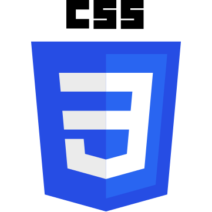
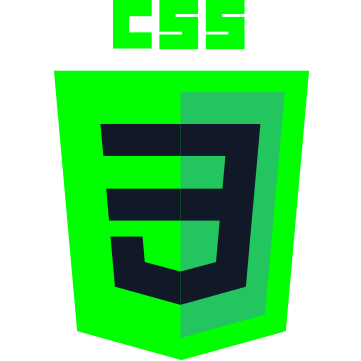
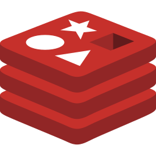
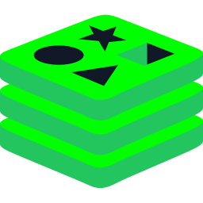
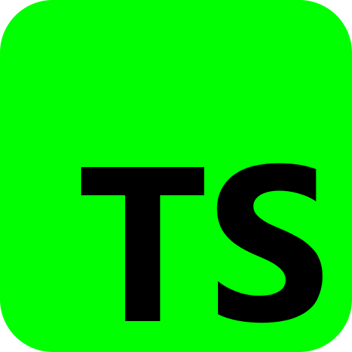
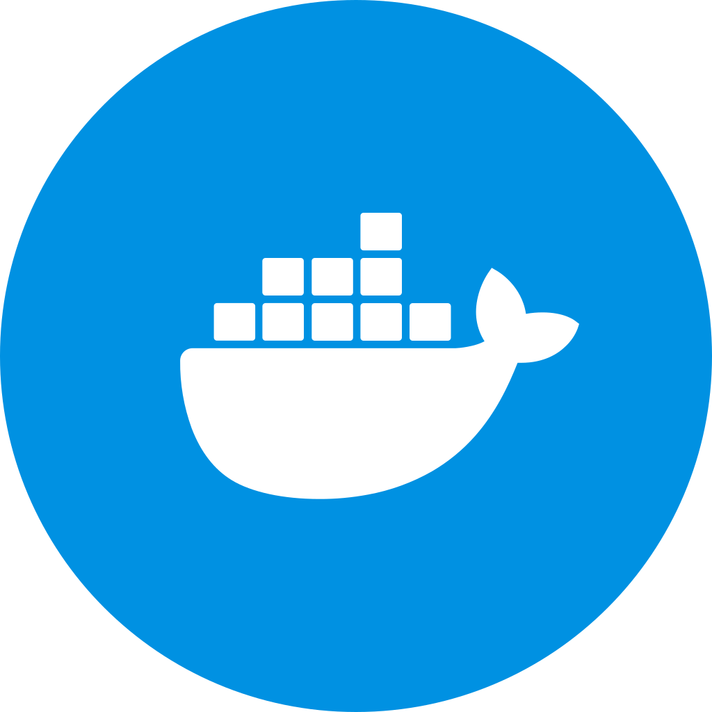
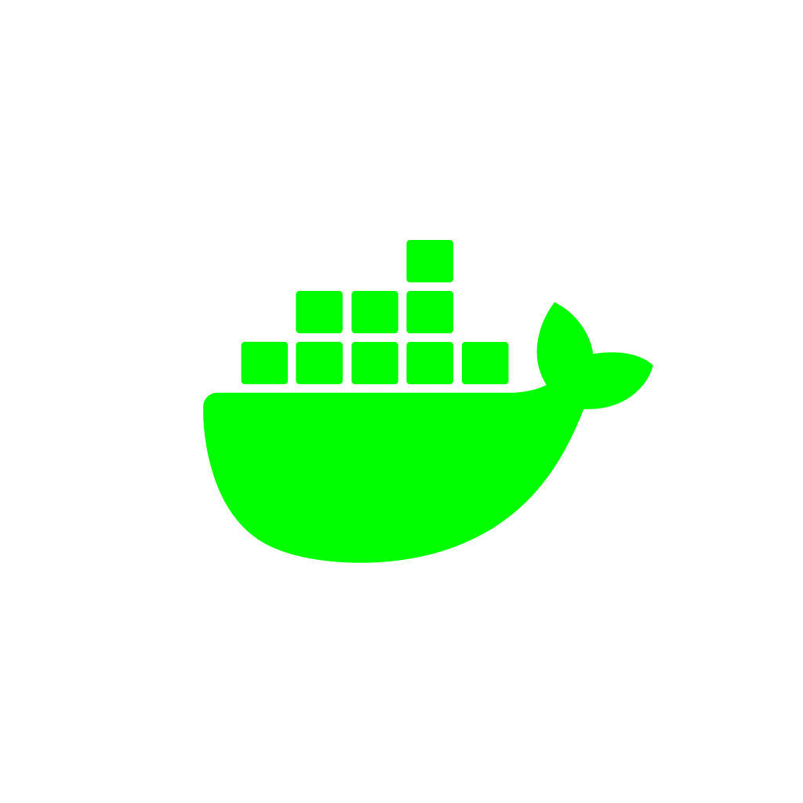
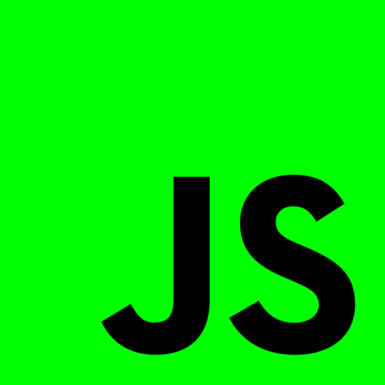
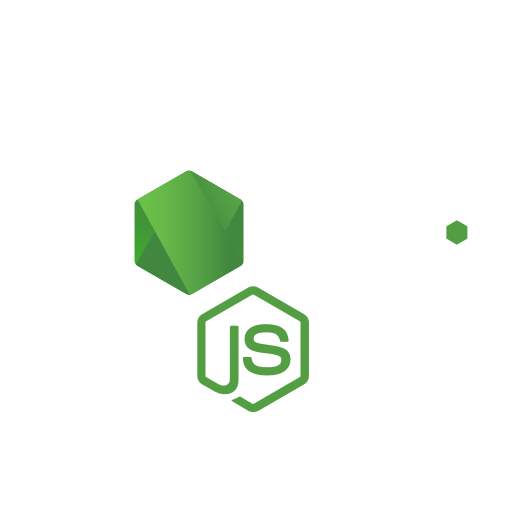
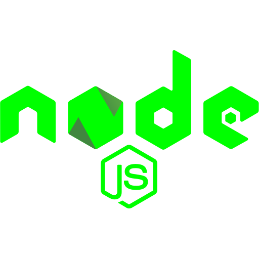

# Documentation des technologies — Matrix BZH

Documentation des stacks technologiques présentées sur les trois jours.
Pour chaque technologie : le logo couleur d'origine, sa variante en vert, le nom et un descriptif.

---

## Mercredi

| Logo | Logo (vert) | Technologie | Descriptif |
|:----:|:-----------:|-------------|------------|
|  |  | **Angular** | Framework front-end TypeScript développé par Google pour construire des applications web monopages (SPA) structurées. |
|  |  | **Claude AI** | Assistant d'intelligence artificielle d'Anthropic, utilisé pour la génération de code, l'analyse et l'aide à la rédaction. |
|  |  | **CSS3** | Langage de feuilles de style pour la mise en forme et la mise en page des pages web. |
|  |  | **Git** | Système de gestion de versions distribué pour suivre l'historique du code et collaborer en équipe. |
|  |  | **Java** | Langage de programmation orienté objet, robuste et portable, largement utilisé côté serveur et en entreprise. |
|  |  | **MongoDB** | Base de données NoSQL orientée documents, stockant les données au format JSON/BSON pour une grande flexibilité. |
|  |  | **PostgreSQL** | Système de gestion de base de données relationnelle open source, reconnu pour sa robustesse et sa conformité SQL. |
|  |  | **Python** | Langage de programmation polyvalent et lisible, populaire en développement web, data science et automatisation. |
|  |  | **Redis** | Base de données clé-valeur en mémoire, ultra-rapide, utilisée pour le cache, les files d'attente et le temps réel. |
|  |  | **TypeScript** | Surcouche typée de JavaScript apportant un typage statique pour des applications plus fiables et maintenables. |

---

## Jeudi

| Logo | Logo (vert) | Technologie | Descriptif |
|:----:|:-----------:|-------------|------------|
|  |  | **AWS** | Plateforme cloud d'Amazon offrant calcul, stockage, bases de données et services managés à la demande. |
|  |  | **GitHub Copilot** | Assistant de codage IA qui suggère du code en temps réel directement dans l'éditeur. |
|  |  | **Docker** | Plateforme de conteneurisation pour packager et déployer des applications de façon portable et reproductible. |
|  |  | **HTML5** | Langage de balisage standard structurant le contenu des pages et applications web. |
|  |  | **JavaScript** | Langage de programmation du web, exécuté côté client comme côté serveur, au cœur des applications interactives. |
|  |  | **Node.js** | Environnement d'exécution JavaScript côté serveur, basé sur le moteur V8, idéal pour les applications réseau. |
|  |  | **Postman** | Outil de conception, de test et de documentation d'API HTTP/REST. |
|  |  | **React** | Bibliothèque JavaScript de Meta pour construire des interfaces utilisateur à base de composants. |
|  |  | **Rust** | Langage système orienté performance et sûreté mémoire, sans ramasse-miettes. |
|  |  | **Vue.js** | Framework JavaScript progressif pour construire des interfaces utilisateur de manière incrémentale. |

---

## Vendredi

| Logo | Logo (vert) | Technologie | Descriptif |
|:----:|:-----------:|-------------|------------|
|  |  | **Claude AI** | Assistant d'intelligence artificielle d'Anthropic, utilisé pour la génération de code, l'analyse et l'aide à la rédaction. |
|  |  | **GitHub Copilot** | Assistant de codage IA qui suggère du code en temps réel directement dans l'éditeur. |
|  |  | **Git** | Système de gestion de versions distribué pour suivre l'historique du code et collaborer en équipe. |
|  |  | **HTML5** | Langage de balisage standard structurant le contenu des pages et applications web. |
|  |  | **MongoDB** | Base de données NoSQL orientée documents, stockant les données au format JSON/BSON pour une grande flexibilité. |
|  |  | **Node.js** | Environnement d'exécution JavaScript côté serveur, basé sur le moteur V8, idéal pour les applications réseau. |
|  |  | **Python** | Langage de programmation polyvalent et lisible, populaire en développement web, data science et automatisation. |
|  |  | **React** | Bibliothèque JavaScript de Meta pour construire des interfaces utilisateur à base de composants. |
|  |  | **TypeScript** | Surcouche typée de JavaScript apportant un typage statique pour des applications plus fiables et maintenables. |
|  |  | **Vue.js** | Framework JavaScript progressif pour construire des interfaces utilisateur de manière incrémentale. |
